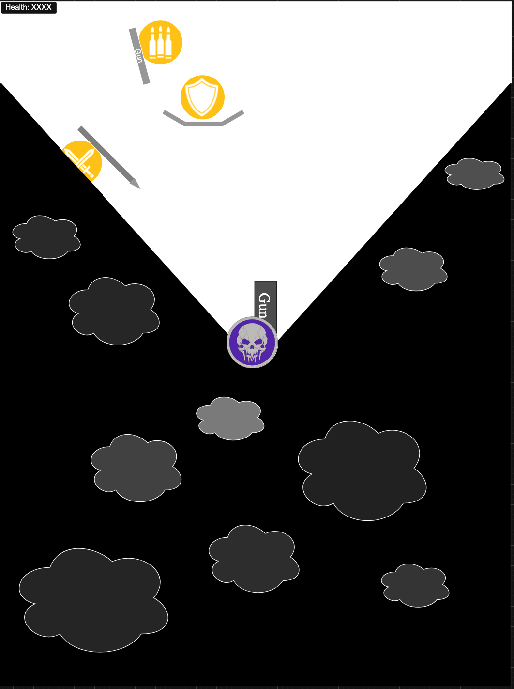
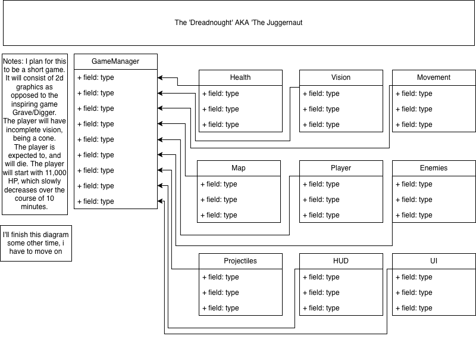

# Project Title
The Dreadnought

### THIS GAME REQUIRES PYGAME
[Pygame installation guide](https://www.pygame.org/wiki/GettingStarted)
## Description
This is a short, <10 minute game. I can't talk much about the exact details of this since it is for school and the description is dark, but you may find more details here: [Grave/Digger The Dreadnought Trello](https://trello.com/c/Ho3QNQUG/234-the-dreadnought)

## Purpose
I'm making this project since the game of which it's inspired by, is what I consider a rare gem in today's world. I'm soley making this since I thought it would be enjoyable.

## Target User
Myself, other fans of Grave/Digger.

## Planned Features
- Feature 1
- Feature 2
- Feature 3

## Program Structure
List the main classes or components you expect to create.

## Challenges
Everything cause buns at coding

## Mockup

## Class Diagram

